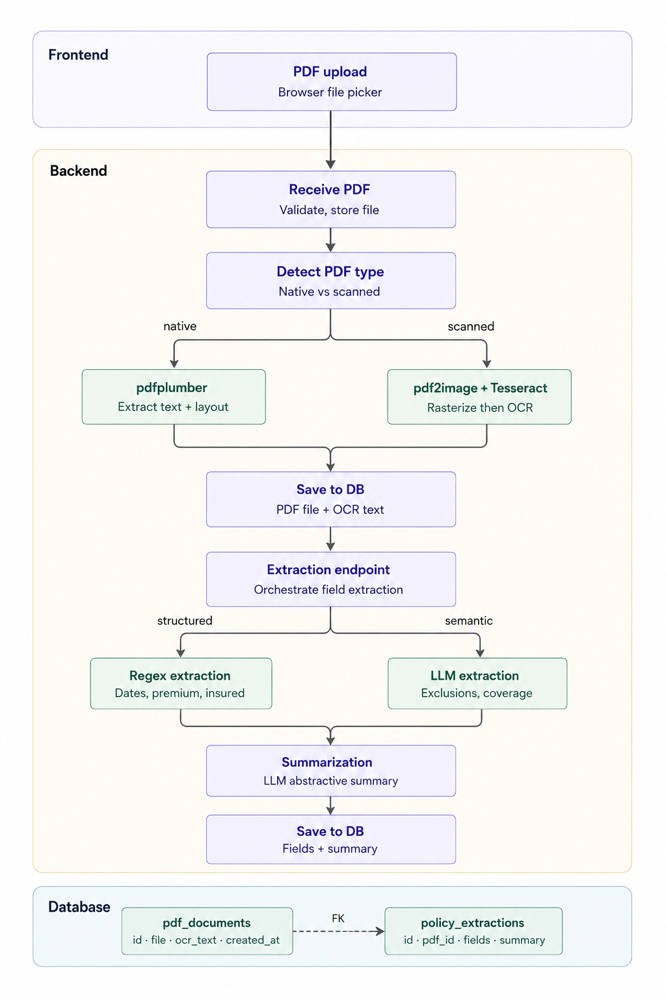

# Insurance-Document-Summarizer

## Overview

This system contains end-to-end component:

- `frontend/`: React app to upload a PDF and view the results
- `backend/`: Express API that receives the upload, runs text extraction, generates summary, and stores everything in SQLite

### Design Architecture

## API

See full API documentation: [api.md](./api.md)

1. Upload PDF: `/api/pdf-upload`
2. Extract fields: `/api/pdf-extract-fields`
3. Fetch results: `/api/extracted-fields/:id`
4. List resultsL `api/documents`

### Run

1. Install frontend deps:
   - `npm --prefix ./frontend install`
2. Install backend deps:
   - `npm --prefix ./backend install`
   - `python3 -m pip install -r ./backend/requirements.txt`
   - Make sure system binaries are installed:
     - `tesseract`
     - `poppler` (required by `pdf2image`)
3. Start backend:
   - `npm --prefix ./backend run dev` (listens on `http://localhost:3002`)
4. Start frontend:
   - `npm --prefix ./frontend run dev` (Vite on `http://localhost:5173`)
